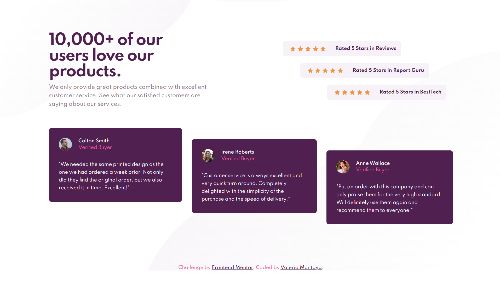

# Frontend Mentor - Social proof section solution

This is a solution to the [Social proof section challenge on Frontend Mentor](https://www.frontendmentor.io/challenges/social-proof-section-6e0qTv_bA). Frontend Mentor challenges help you improve your coding skills by building realistic projects.

## Table of contents

- [Overview](#overview)
  - [The challenge](#the-challenge)
  - [Screenshot](#screenshot)
  - [Links](#links)
- [My process](#my-process)
  - [Built with](#built-with)
  - [What I learned](#what-i-learned)
- [Author](#author)

## Overview

### The challenge

Users should be able to:

- View the optimal layout for the section depending on their device's screen size

### Screenshot



### Links

- Solution URL: [GitHub Repository](https://github.com/ValeriaMontoya/social-proof-section)
- Live Site URL: [Site URL](https://valeriamontoya.github.io/social-proof-section/)

## My process

### Built with

- Semantic HTML5 markup
- CSS custom properties
- Flexbox
- Mobile-first workflow

### What I learned

In this challenge I was able to practice my Flexbox skills. At first I didn't know how I'll get the design, but then I thought about the _align-self_ property and I figure it out. Here is how I used this property.

```css
.card:first-of-type {
  align-self: flex-start;
}

.card:nth-of-type(2) {
  align-self: center;
}

.card:last-of-type {
  align-self: flex-end;
}
```

## Author

- Frontend Mentor - [@ValeriaMontoya](https://www.frontendmentor.io/profile/ValeriaMontoya)
- Twitter - [@vale_montoya\_](https://twitter.com/vale_montoya_)
